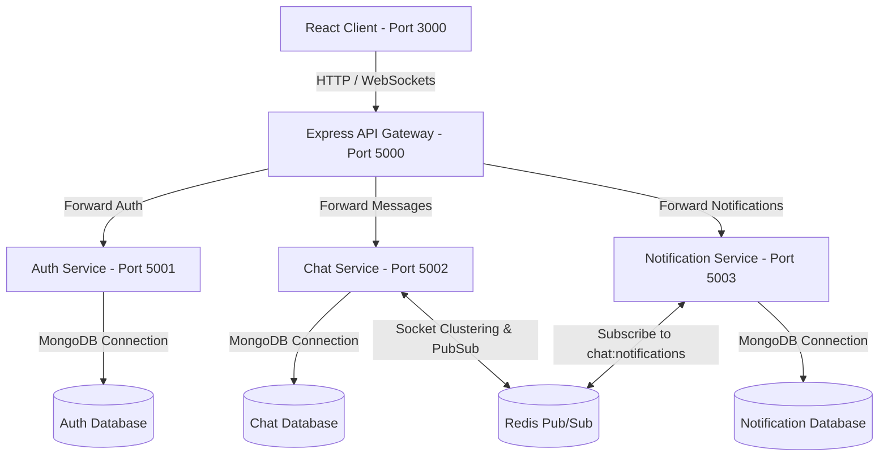

# 🚀 Microservices-Based Real-Time Chat Application

An enterprise-grade, production-ready, highly-scalable Real-Time Chat Workspace built using the **MERN Stack** (MongoDB, Express, React, Node.js), clustered **Socket.IO** communication, **Redis Pub/Sub** horizontal scaling, **Docker Compose** containerization, and fully automated **CI/CD pipelines** (GitHub Actions + Jenkins).

---

## 📐 Systems Architecture & Communication Flow

This application is designed following the **decoupled microservices architecture pattern**. Each service possesses its own database boundaries, business logic, container packaging, and independent ports.



### Key Technical Patterns:
1. **API Gateway Routing**: Single endpoint (`http://localhost:5000`) for all incoming traffic. Rate limits requests (`express-rate-limit`), enforces custom security policies (`helmet`), log events (`morgan`), and proxies routing using `http-proxy-middleware`.
2. **Centralized Authentication**: The Gateway verifies incoming JWT tokens. If validated, it extracts the user ID, email, role, and username and forwards them to internal services via HTTP headers (`x-user-id`, `x-user-role`, `x-user-email`). This eliminates redundant token parsing downstream.
3. **Horizontal Socket Scaling**: Multi-node Socket.IO instances sync states (like room listings, typing states, and online user counts) using `@socket.io/redis-adapter` over **Redis**.
4. **Event-Driven Services**: When messages are written in a room, the Chat Service publishes an alert payload on a Redis channel (`chat:notifications`). The Notification Service subscribes to this channel, retrieves the workspace user database from the Auth Service via REST, and creates unread notification entries for other users in the background.

---

## 📁 Repository Directory Structure

```
chat-app/
├── client/                      # React Frontend Web Client (Vite + Tailwind CSS)
│   ├── public/
│   ├── src/
│   │   ├── components/          # Reusable component elements
│   │   ├── context/             # AuthContext, SocketContext, NotificationContext
│   │   ├── pages/               # Login, Register, Dashboard views
│   │   ├── services/            # Axios API wrappers
│   │   ├── App.jsx
│   │   └── main.jsx
│   ├── Dockerfile
│   ├── nginx.conf
│   └── package.json
│
├── gateway/                     # Central API Gateway Proxy
│   ├── index.js
│   ├── Dockerfile
│   └── package.json
│
├── services/
│   ├── auth-service/            # Authentication Microservice (JWT, Hashing)
│   │   ├── controllers/
│   │   ├── models/
│   │   ├── routes/
│   │   ├── tests/               # Jest Integration Tests
│   │   ├── index.js
│   │   └── Dockerfile
│   │
│   ├── chat-service/            # Scalable Real-time Chat Service (Socket.IO, Redis)
│   │   ├── socket/              # Socket.IO Event Handlers
│   │   ├── controllers/
│   │   ├── models/
│   │   └── Dockerfile
│   │
│   └── notification-service/    # Background Notification Consumer
│       ├── controllers/
│       ├── models/
│       ├── routes/
│       └── Dockerfile
│
├── .github/workflows/
│   └── ci.yml                   # GitHub Actions pipeline
│
├── docker-compose.yml           # Local cluster environment setup
├── Jenkinsfile                  # Jenkins automation deployment pipeline
└── README.md
```

---

## ⚙️ Environment Variables Setup

Each service is fully parameterized. Duplicate the `.env.example` templates in each folder to configure keys.

### 🌐 API Gateway (`/gateway/.env`)
```env
PORT=5000
AUTH_SERVICE_URL=http://localhost:5001
CHAT_SERVICE_URL=http://localhost:5002
NOTIFICATION_SERVICE_URL=http://localhost:5003
JWT_SECRET=supersecretkey
CLIENT_URL=http://localhost:3000
```

### 🔒 Auth Service (`/services/auth-service/.env`)
```env
PORT=5001
MONGO_URI=mongodb://localhost:27017/auth_db
JWT_SECRET=supersecretkey
JWT_EXPIRES_IN=24h
```

### 💬 Chat Service (`/services/chat-service/.env`)
```env
PORT=5002
MONGO_URI=mongodb://localhost:27017/chat_db
REDIS_HOST=127.0.0.1
REDIS_PORT=6379
JWT_SECRET=supersecretkey
```

### 🔔 Notification Service (`/services/notification-service/.env`)
```env
PORT=5003
MONGO_URI=mongodb://localhost:27017/notification_db
REDIS_HOST=127.0.0.1
REDIS_PORT=6379
AUTH_SERVICE_URL=http://localhost:5001
JWT_SECRET=supersecretkey
```

---

## 🐳 Quickstart: Deploying with Docker Compose

Spin up the entire microservices mesh (MongoDB, Redis, microservices, API gateway, React app) using a single command:

```bash
# Clone the repository
git clone <your-repo>
cd chat_app

# Launch in detached background mode
docker-compose up -d --build
```

### Exposed Web Endpoints:
- **React Client Interface**: `http://localhost:3000`
- **Central API Gateway**: `http://localhost:5000`
- **MongoDB Instance**: `http://localhost:27017`
- **Redis Cache/PubSub**: `http://localhost:6379`

---

## 🛠️ API & Socket Event Reference

### Central API Gateway Endpoints (`http://localhost:5000`)

#### 🔒 Auth Service Endpoints
- `POST /api/auth/register` : Register user. Body: `{ username, email, password }`
- `POST /api/auth/login` : Login user. Body: `{ email, password }`
- `GET /api/auth/profile` : Fetch active user profile. (Requires `Authorization: Bearer <JWT>`)
- `GET /api/auth/users` : Fetch all system user records.

#### 💬 Chat Service Endpoints
- `GET /api/rooms` : Get list of all available rooms. (Requires Bearer Token)
- `POST /api/rooms` : Create a custom room. Body: `{ name, description }`
- `GET /api/messages/:roomId` : Fetch latest 100 room messages. (Requires Bearer Token)
- `POST /api/messages` : Send REST message fallback. Body: `{ roomId, message }`

#### 🔔 Notification Service Endpoints
- `GET /api/notifications/:userId` : Get notifications list. (Requires Bearer Token)
- `PUT /api/notifications/read/:id` : Mark notification as read. (Requires Bearer Token)

---

### 📡 Socket.IO Client Events (`/socket.io`)

Sockets are connected directly to the central gateway port `5000` (which proxies connection handshakes to the Chat Service with WebSocket transport support).

| Event Name | Direction | Payload | Description |
| :--- | :--- | :--- | :--- |
| **`connection`** | Client -> Server | Handshake Auth: `{ token }` | Initiates real-time sessions. |
| **`joinRoom`** | Client -> Server | `roomId` | Subscribes current socket to a chat room. |
| **`sendMessage`**| Client -> Server | `{ roomId, message }` | Sends message, persists to MongoDB, broadcasts, publishes Redis. |
| **`receiveMessage`**| Server -> Client | `{ senderId, senderUsername, message, timestamp }` | Dispatches new text block to room. |
| **`typing`** | Client -> Server | `{ roomId, isTyping }` | Emits typing state toggles. |
| **`onlineUsersList`**| Server -> Client | `['user1', 'user2', ...]` | Distributes real-time list of online members. |

---

## 🧪 Testing Backend Services

Tests are implemented using **Jest** and **Supertest** to test routes and database integrations in a container or local sandbox.

```bash
# Run tests inside auth-service
cd services/auth-service
npm install
npm run test
```

---

## 🔁 CI/CD Automation Design

### 🐙 GitHub Actions CI Pipeline (`.github/workflows/ci.yml`)
The workflow operates on every push/PR to `main` and `master`:
1. **Lint & Test**: Installs all service dependencies, runs linting, and runs backend Jest integration tests.
2. **Build and Tag**: Uses QEMU and Buildx to package Docker images for Gateway, Auth, Chat, Notification, and React client.
3. **Publish to GHCR**: Log in to GitHub Container Registry using `GITHUB_TOKEN` and publishes tagged images as `ghcr.io/<github-username>/<service-image>:latest`.

### 🛠️ Jenkins Continuous CD Deployment (`Jenkinsfile`)
Jenkins automates local rolling redeployment utilizing `pollSCM`:
1. Checks out branch changes from git repository.
2. Creates an isolated environment inside a Node container to run Jest testing frameworks.
3. Triggers clean rebuilds: `docker-compose build --no-cache`.
4. Gracefully shuts down older containers: `docker-compose down`.
5. Deploys updated containers in detached background states.
6. Runs a shell-probing script to verify Gateway port `5000` is active and healthy before closing pipeline.
